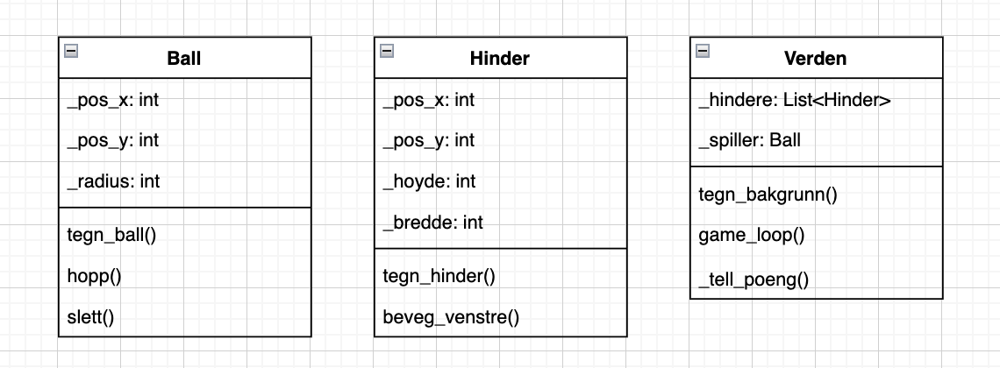
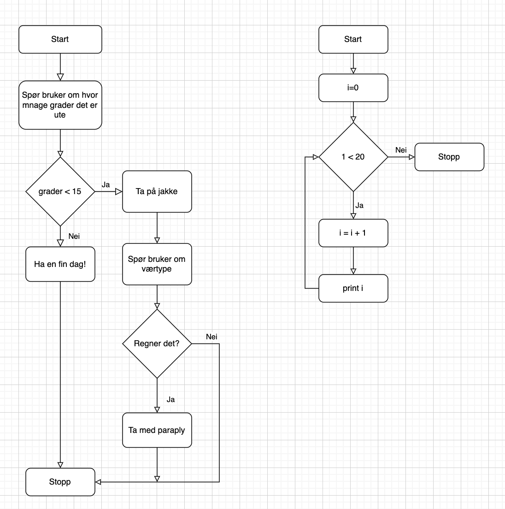

# Objektorienterte modeller som som beskriver programstruktur
## UML-diagram
UML-diagram står for 'Unified Modeling Language'. Det brukes for lage modeller eller planlegge prosjekter innenfor objektorienterte programmer. Der setter man opp de ulike klassene man skal ha i programmet og gir hver enkelte klasse de egenskapene og metodene den skal ha. I tillegg viser UML-diagrammer sammenhengen mellom klassene. 

## Eksempler

# Representasjon av programflyt med kontrollstrukturer
## Flytdiagram 
Flytdiagram kan brukes for å planlagge programmer eller forklare hva som skjer i et allerede ferdig program. Flytdiagrammet tar for seg valgene/stegene i prorgammet skritt for skritt og viser utfallet. 

## Eksempler

